<p align="center">
  
</p>

<p align="center">
  <strong>GNU <code>watch</code>, supercharged with email notifications.</strong><br/>
  Know the instant your command output changes — in the terminal <em>and</em> your inbox.
</p>

<p align="center">
  <a href="#quickstart">Quickstart</a> · <a href="#examples">Examples</a> · <a href="#flags">Flags</a> · <a href="#configuration">Configuration</a>
</p>

---

## Why watch+?

You're already running `watch` to keep an eye on things. But you can't stare at a terminal forever.

**watch+** is a drop-in replacement for GNU `watch` that adds email alerts via [Resend](https://resend.com). Same flags, same behavior — plus a `--email` flag that changes everything.

```mermaid
flowchart TD
    Command["🐚 Your Shell Command"] -->|runs every N seconds| WatchPlus["⚡ watch+"]
    WatchPlus --> Terminal["🖥️ Terminal\nfullscreen with diff highlight"]
    WatchPlus -->|output changed?| Email["📧 Resend\nemail alert"]

    style Command fill:#1e293b,stroke:#475569,color:#e2e8f0
    style WatchPlus fill:#2d1f4e,stroke:#7c3aed,color:#e2e8f0
    style Terminal fill:#164e63,stroke:#06b6d4,color:#e2e8f0
    style Email fill:#4c1d95,stroke:#a78bfa,color:#e2e8f0
```



## Quickstart

```bash
# Install dependencies
bun install

# Build a standalone binary
bun run build         # → ./watch+

# Or run directly
bun run src/index.ts -n 1 date
```

> **Cross-compile for Linux:** `bun build --compile --target=bun-linux-x64 src/index.ts --outfile watch+-linux-amd64`

## Examples

```bash
# 🕐 Live-updating clock
watch+ -n 1 date

# 🔍 Highlight changes to a file
watch+ -d -n 1 "cat /tmp/test.txt"

# 🚪 Exit as soon as output changes
watch+ -g -n 1 "date +%S"

# 📧 Email yourself when an API response changes
watch+ --email me@example.com \
       --from noreply@mydomain.com \
       --cooldown 30s \
       -n 2 \
       "curl -s https://api.example.com/status"

# 📊 Count errors in a log file
watch+ -n 5 -- grep -c ERROR /var/log/app.log
```

## Flags

### GNU watch compatible

All the flags you know. Fully compatible — swap `watch` for `watch+` in your scripts.

| Flag | Description |
|------|-------------|
| `-n, --interval <secs>` | Seconds between updates (default: `2`) |
| `-d, --differences [permanent]` | Highlight changes between updates |
| `-e, --errexit` | Exit on non-zero return code |
| `-g, --chgexit` | Exit when output changes |
| `-c, --color` | Pass through ANSI color sequences |
| `-C, --no-color` | Strip ANSI color sequences |
| `-t, --no-title` | Suppress header |
| `-w, --no-wrap` | Truncate long lines |
| `-x, --exec` | Pass command to exec instead of `sh -c` |
| `-p, --precise` | Attempt precise timing |
| `-b, --beep` | Beep on change |

### Email notifications (the + in watch+)

| Flag | Description |
|------|-------------|
| `--email <address>` | Email address to notify on change |
| `--from <address>` | Sender email address (required with `--email`) |
| `--cooldown <duration>` | Min time between emails — e.g. `30s`, `5m`, `1h` (default: `1m`) |
| `--subject <text>` | Custom email subject |
| `--api-key <key>` | Resend API key |

### Keyboard

| Key | Action |
|-----|--------|
| <kbd>Space</kbd> | Force an immediate re-run |
| <kbd>q</kbd> | Quit |
| <kbd>Ctrl+C</kbd> | Quit |

## Architecture


| Module | Responsibility |
|--------|---------------|
| **index.ts** | CLI parsing with Commander, flag validation |
| **config.ts** | Loads `~/.watch+/config.json`, merges CLI + env + config with correct priority |
| **watch.ts** | Core loop — executes command, diffs output, renders fullscreen terminal UI |
| **diff.ts** | Change detection, unified diff generation, HTML formatting for emails |
| **email.ts** | Sends notifications via Resend with cooldown throttling |

## Configuration

Create `~/.watch+/config.json` to set defaults so you don't have to pass flags every time:

```json
{
  "resendApiKey": "re_...",
  "defaultTo": "alerts@example.com",
  "defaultFrom": "watch+@mydomain.com",
  "defaultCooldown": "5m",
  "defaultInterval": 2
}
```

The Resend API key can also be set via the `RESEND_API_KEY` environment variable.

> **Priority:** CLI flags > environment variables > config file > defaults

---

<p align="center">
  Built with <a href="https://bun.sh">Bun</a> + TypeScript
</p>
